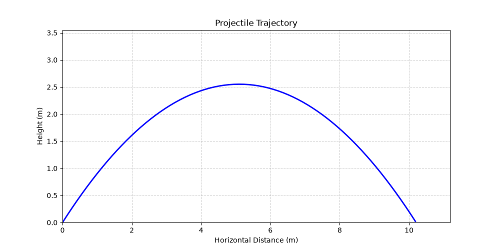

# 🔬 Projectile Physics Simulator

[](https://github.com/mohammad-hussein-dev/projectile-physics-simulator/actions/workflows/ci.yml)
[](https://codecov.io/gh/mohammad-hussein-dev/projectile-physics-simulator)
[](https://www.python.org/downloads/)
[](https://opensource.org/licenses/MIT)
[](https://github.com/psf/black)
[](https://pycqa.github.io/isort/)

> **A scientific and educational tool for modeling projectile motion** — turning physics equations into visual trajectories with Python.

---

## 📑 Table of Contents

- [Overview](#-overview)
- [Features](#-features)
- [Technology Stack](#-technology-stack)
- [Installation & Usage](#-installation--usage)
- [Sample Output](#-sample-output)
- [Testing](#-testing)
- [Project Structure](#-project-structure)
- [Development Workflow](#-development-workflow)
- [Contributing](#-contributing)
- [License](#-license)
- [Author](#-author)

---

## 📖 Overview

**Projectile Physics Simulator** is a scientific and educational Python tool for modeling and visualizing projectile motion under gravity. It uses Newtonian physics equations to calculate trajectory parameters such as range, maximum height, and flight time, with optional air resistance support.

The project features a clean, modular architecture with bilingual support (Persian/English), making it ideal for physics students, educators, and anyone interested in computational physics.

**Perfect for:**
- Learning physics through interactive simulation
- Teaching projectile motion concepts
- Showcasing clean Python code with scientific computing
- Portfolio projects for aspiring computational scientists

---

## ✨ Features

| Feature | Description |
| :--- | :--- |
| **Physics Calculations** | Accurate computation of range, max height, flight time, and trajectory points |
| **Air Resistance** | Optional simplified drag model for more realistic simulations |
| **2D Visualization** | Trajectory plotting with matplotlib showing velocity vectors, peak, and impact points |
| **Bilingual Support** | Full support for both **Persian (فارسی)** and **English** interfaces |
| **Modular Code** | Clean, well-structured, and maintainable Python code |
| **CLI Interface** | Command-line interface for quick simulations |
| **CI/CD** | GitHub Actions with linting, testing, and coverage |
| **Testing** | Unit tests with pytest and coverage reporting |

---

## 🛠️ Technology Stack

| Category | Technologies |
| :--- | :--- |
| **Language** | Python 3.8+ |
| **Scientific Computing** | NumPy |
| **Visualization** | Matplotlib |
| **Testing** | pytest, pytest-cov |
| **Code Quality** | Black, Ruff, MyPy, Pre-commit |
| **CI/CD** | GitHub Actions, Codecov |
| **OS** | Arch Linux (development), Any Linux / macOS / Windows (runtime) |

---

## 🚀 Installation & Usage

### 1. Clone the repository

```bash
git clone https://github.com/mohammad-hussein-dev/projectile-physics-simulator.git
cd projectile-physics-simulator
```

### 2. Set up a virtual environment (recommended)

```bash
python -m venv .venv
source .venv/bin/activate  # On Windows: .venv\Scripts\activate
```

### 3. Install dependencies

```bash
pip install -r requirements.txt
```

### 4. Run the simulation

```bash
python -m projectile_simulator
```

Or use the CLI interface:

```bash
python src/projectile_simulator/cli.py
```

You will see:
- **Trajectory parameters** (range, max height, flight time)
- **2D plot** showing the projectile path with velocity vectors

---

## 🌐 Bilingual Output

The simulator supports both **English** and **Persian (فارسی)** output formats.

### How to switch language:

**Option 1: Set environment variable**
```bash
export LANG=fa  # for Persian
export LANG=en  # for English (default)
python -m projectile_simulator
```

**Option 2: Pass argument to CLI** (if implemented)
```bash
python src/projectile_simulator/cli.py --lang fa
python src/projectile_simulator/cli.py --lang en
```

### Language Outputs

| Language | Terminal Output | Plot Image |
| :--- | :---: | :---: |
| **English** | ✅ | `trajectory_en.png` |
| **Persian (فارسی)** | ✅ | `trajectory_fa.png` |

---

## 🖼️ Demo

| English | Persian (فارسی) |
| :---: | :---: |
|  |  |

*The plots show the projectile trajectory (blue curve), velocity vectors (red arrows), and key points (peak and impact).*

---

## 📊 Sample Output

### Terminal Output (English)

```
🚀 Projectile Physics Simulator

Initial velocity: 50.0 m/s
Launch angle: 45.0°
Gravity: 9.81 m/s²

📊 Results:
  Range: 254.84 m
  Max Height: 63.71 m
  Flight Time: 7.21 s
```

### خروجی ترمینال (فارسی)

```
🚀 شبیه‌ساز حرکت پرتابه

سرعت اولیه: ۵۰.۰ متر بر ثانیه
زاویه پرتاب: ۴۵.۰ درجه
شتاب گرانش: ۹.۸۱ متر بر مجذور ثانیه

📊 نتایج:
  برد: ۲۵۴.۸۴ متر
  حداکثر ارتفاع: ۶۳.۷۱ متر
  زمان پرواز: ۷.۲۱ ثانیه
```

---

## 🧪 Testing

Run the test suite with:

```bash
pytest tests/
```

Generate a coverage report:

```bash
pytest --cov=src tests/
```

Check code style:

```bash
ruff check .
```

Format code:

```bash
black .
```

---

## 📁 Project Structure

```
projectile-physics-simulator/
├── .github/
│   └── workflows/
│       └── ci.yml                 # GitHub Actions CI
├── src/
│   └── projectile_simulator/
│       ├── __init__.py
│       ├── __main__.py
│       ├── physics.py             # Physics calculations (range, height, time)
│       ├── visualizer.py          # 2D trajectory plotting
│       └── cli.py                 # Command-line interface
├── tests/
│   ├── __init__.py
│   ├── test_physics.py
│   ├── test_visualizer.py
│   └── test_cli.py
├── README.md
├── requirements.txt
├── requirements-dev.txt
├── .gitignore
├── .pre-commit-config.yaml
├── pyproject.toml
├── setup.py
├── LICENSE
└── .coveragerc
```

---

## 🔄 Development Workflow

1. **Fork** the repository
2. **Create a feature branch**: `git checkout -b feature/your-feature`
3. **Install pre-commit hooks**: `pre-commit install`
4. **Commit changes**: `git commit -m "Add your feature"`
5. **Push**: `git push origin feature/your-feature`
6. **Open a Pull Request**

---

## 🤝 Contributing

Contributions are welcome! Please follow the standard GitHub flow:
- Open an issue to discuss your idea
- Submit a pull request with clear description and tests

---

## 📄 License

This project is open-source and available under the **MIT License**.

---

## 👤 Author

**Mohammad Hussein**  
- GitHub: [@mohammad-hussein-dev](https://github.com/mohammad-hussein-dev)  
- Email: king.mohamd.09876@gmail.com  
- Telegram: @mohammad_hussein_dev

---

> *"Physics is the law, Mathematics is the language, and Code is the tool to build anything imaginable."*

Mirrored to GitLab ✅
