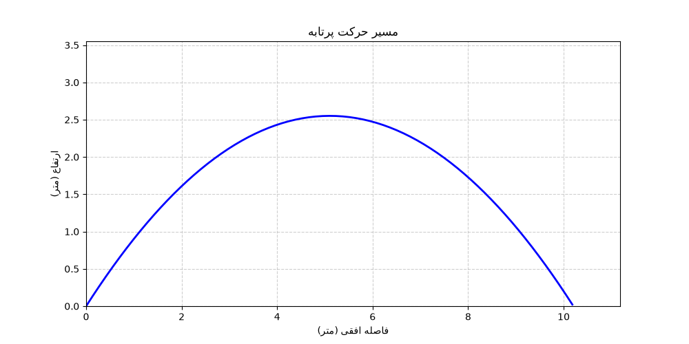

## 📊 Sample Output

### English Version

**Terminal Output:**

```bash
========================================
🚀 Projectile Physics Simulator
========================================
Enter initial velocity (m/s): 10
Enter angle (degrees): 45

📊 Results:
   Range: 10.20 meters
   Max Height: 2.55 meters
   Time of Flight: 1.44 seconds
```

**Trajectory Plot:**


---

### نسخه‌ی فارسی

**خروجی ترمینال:**

```bash
========================================
🚀 شبیه‌ساز حرکت پرتابه
========================================
سرعت اولیه (m/s) را وارد کنید: 10
زاویه (درجه) را وارد کنید: 45

📊 نتایج:
   برد پرتابه: 10.20 متر
   حداکثر ارتفاع: 2.55 متر
   زمان کل پرواز: 1.44 ثانیه
```

**نمودار مسیر:**


